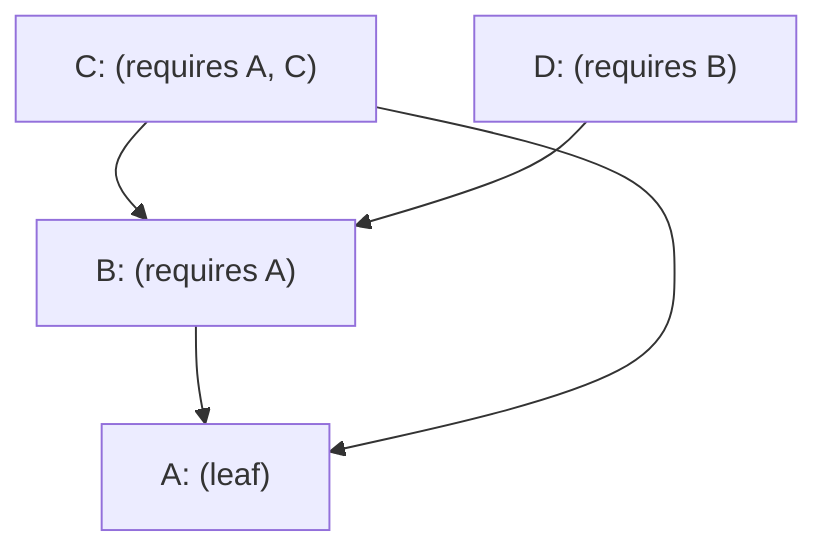

Example of how to export `arbitrary::Arbitrary` implementations in dependent models (including transient dependencies).

(Arrows point *TO* the dependent to the dependency. Love it or hate it.)

Should `B`'s `tests` feature also include `A`'s `tests` feature? Yes. Absolutely, because it is a compile time dependency.

Without that, the compiler would complain that `arbitrary` wasn't implemented for `A` when compiling `D`, which only includes `B`'s `tests` feature. 

`C` *doesn't* require `B` to include `A/tests` in `A`'s `tests` feature because `C` itself includes `A`'s `tests` feature.

NOTE: https://users.rust-lang.org/t/is-this-a-bug-no-but-it-feels-like-a-bug/102893 for discussion